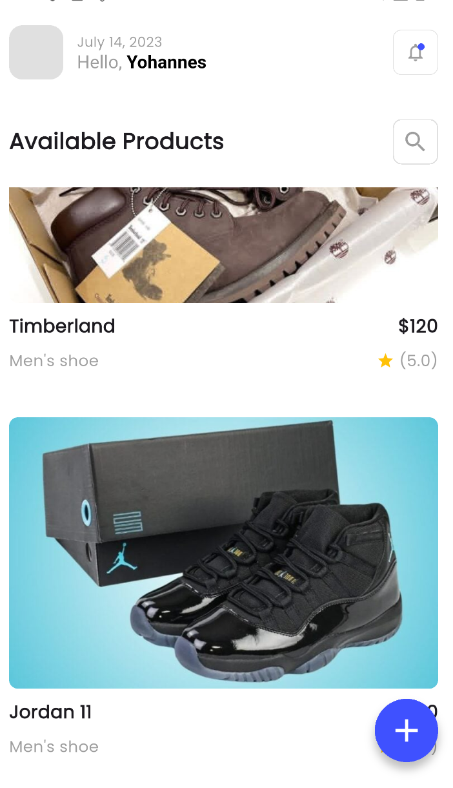
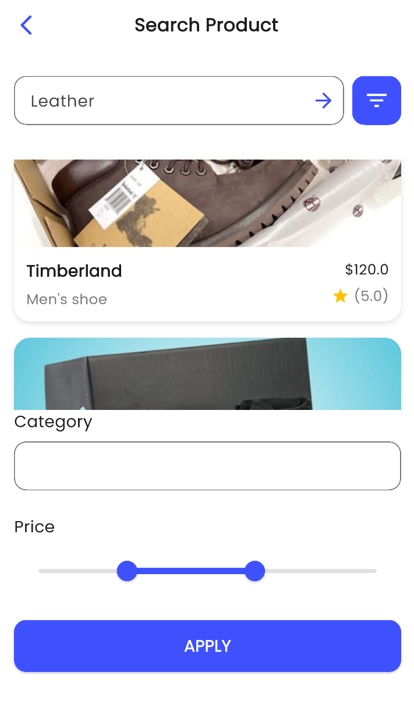
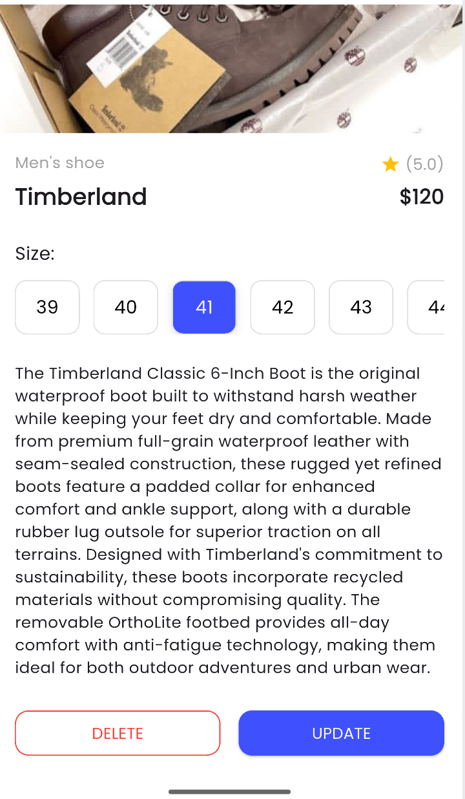
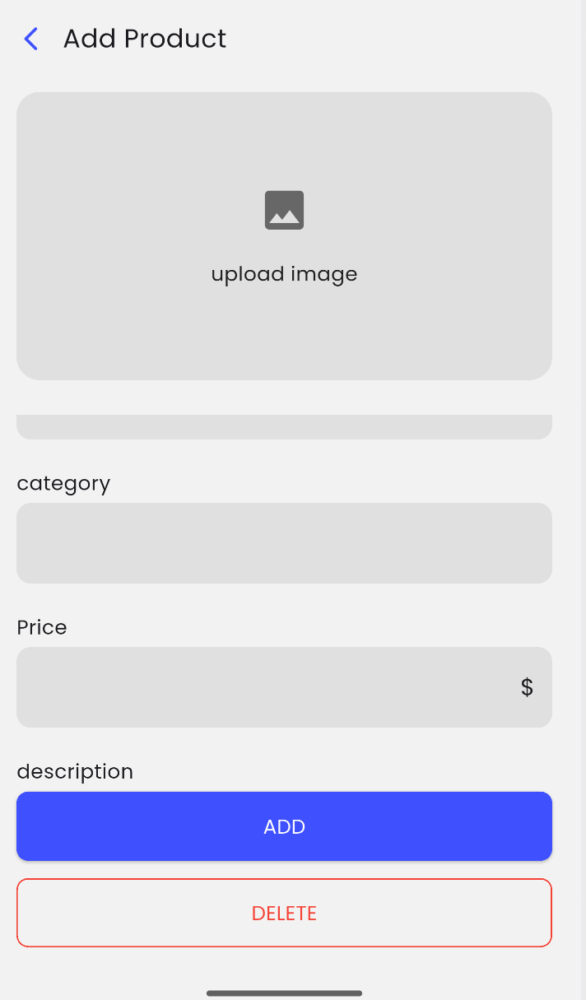

# Flutter E-Commerce UI App

## 📱 App Preview

<div style="display: flex; flex-direction: row; gap: 16px; margin: 20px 0; flex-wrap: nowrap;">

  <div style="flex: 1; min-width: 250px; display: flex; flex-direction: column; align-items: center;">
    
    <p style="text-align: center; margin-top: 8px; font-size: 0.9em;">Home Screen</p>
  </div>

  <div style="flex: 1; min-width: 250px; display: flex; flex-direction: column; align-items: center;">
    
    <p style="text-align: center; margin-top: 8px; font-size: 0.9em;">Search Screen</p>
  </div>

  <div style="flex: 1; min-width: 250px; display: flex; flex-direction: column; align-items: center;">
    
    <p style="text-align: center; margin-top: 8px; font-size: 0.9em;">Details Screen</p>
  </div>

  <div style="flex: 1; min-width: 250px; display: flex; flex-direction: column; align-items: center;">
    
    <p style="text-align: center; margin-top: 8px; font-size: 0.9em;">Add Product</p>
  </div>

</div>

## 📝 Description

A modern Flutter e-commerce app featuring:

- **Product browsing** with clean grid layout  
- **Advanced search** with price range filters  
- **Detailed product views** with size selection  
- **Product management** for adding/editing items  

Built with:  
- Flutter 3.x  
- Material Design 3  
- Responsive layouts  
- Custom UI components  

## 🚀 Getting Started

```bash
flutter pub get
flutter run
